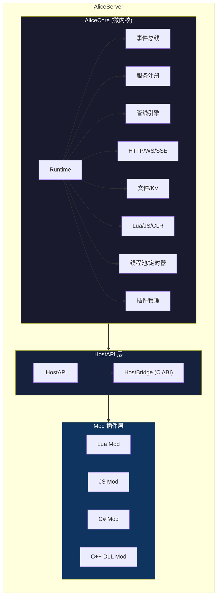
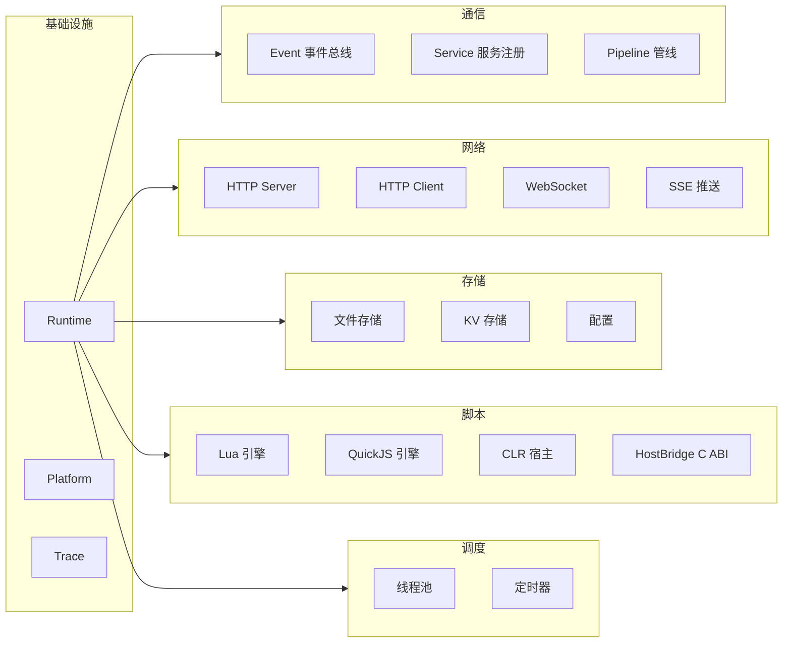
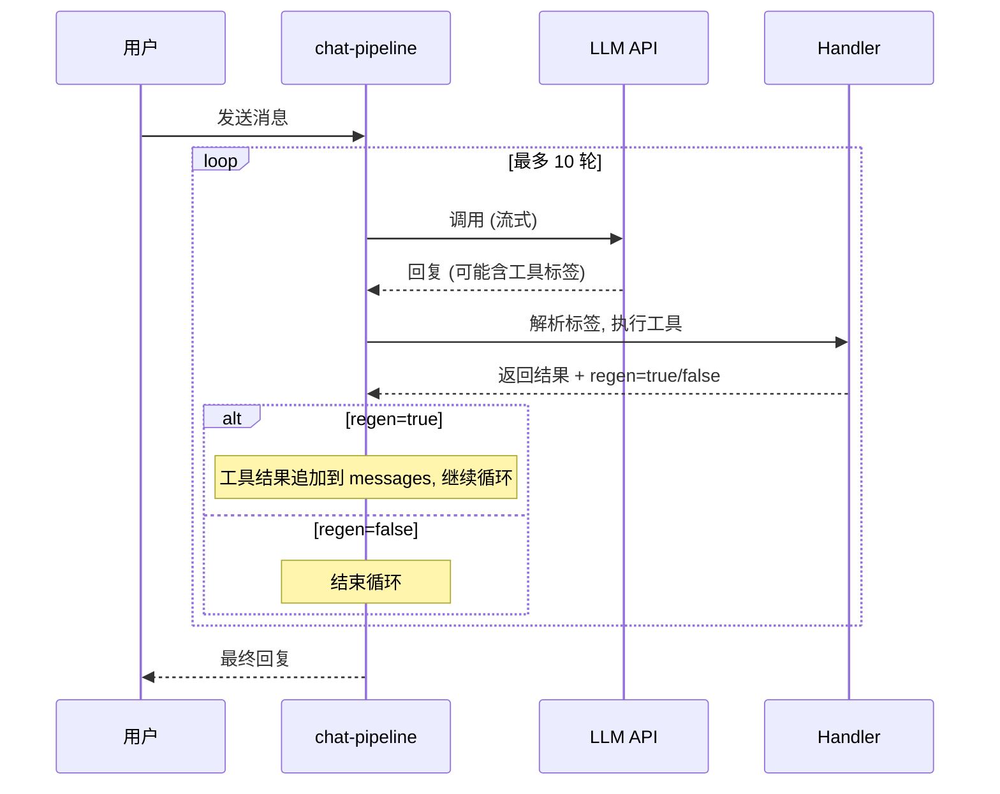

<p align="center">
  
</p>

<h1 align="center">Alice</h1>

<p align="center">C++ 写的 AI Agent 运行时平台。Core 只管提供能力，业务逻辑全部交给 Mod。</p>

## 这是什么

Alice 是一个微内核架构的 AI Agent 平台。核心 (`AliceCore`) 提供运行时基础设施——事件总线、服务注册、管线引擎、HTTP/WS 服务器、脚本引擎、定时器、文件存储等——但不包含任何业务逻辑。所有业务行为（聊天、AI 调用、工具执行、文件操作）都由 Mod 定义。

删掉所有 Mod，Alice 还是能启动，只是什么都不干。

## 特性

- **四种插件语言**: C++ DLL / C# (.NET 10) / Lua / JavaScript (QuickJS)
- **统一 API**: 不管用哪种语言写 Mod，都通过同一套 `alice.*` API 访问平台能力
- **Agent 循环**: Handler + Regen Loop，LLM 可以调用工具、看到结果、继续推理
- **流式输出**: SSE + WebSocket 双通道，Stream Masker 实时隐藏工具调用标签
- **多 LLM 支持**: OpenAI / Claude / Gemini / Vertex AI，协议插件可扩展
- **热重载**: 改了 Mod 文件自动重载，不用重启
- **事件治理**: TTL、链路深度限制、异步分发

## 文档

- [架构设计](docs/ARCHITECTURE.md)
- [编译指南](docs/BUILD.md)
- [Mod 开发指南](docs/PLUGIN_GUIDE.md)
- [alice.* API 参考](docs/API_REFERENCE.md)
- [更新日志](CHANGELOG.md)
- [贡献指南](CONTRIBUTING.md)

## 架构



## 项目结构

```
Alice/
├── AliceCore/          C++ 核心静态库 (12 个模块)
├── AliceServer/        可执行文件入口
├── AliceSdk/           C# 插件 SDK (Alice.SDK.dll)
├── ThirdParty/         第三方依赖 (bee, dotnet hosting)
├── mods/               示例 Mod
│   ├── ai-manager/     多 Provider 路由
│   ├── chat-pipeline/  聊天编排 + Regen Loop
│   ├── providers/      LLM 协议 (openai/claude/gemini/vertexai-cf)
│   ├── handlers/       工具 Handler (code-exec/file-ops/timer)
│   ├── hello-js/       QuickJS 示例
│   └── hello-csharp/   C# 示例
└── docs/               文档
```

## Core 模块



## 编译

### 环境要求

- Visual Studio 2022 (v143 工具链)
- vcpkg (manifest 模式)
- .NET 10 SDK (C# Mod 需要，可选)

### 步骤

```bash
# 1. 克隆
git clone https://github.com/systemal/Alice.git
cd Alice

# 2. vcpkg 会自动安装依赖 (首次编译时)
# 依赖: drogon, lua, sol2, quickjs-ng, nlohmann-json, spdlog

# 3. 用 VS2022 打开 Alice.sln，选 Debug|x64，编译

# 4. 把 mods 复制到输出目录
xcopy /E /I mods Build\bin\Debug\mods

# 5. 运行
Build\bin\Debug\AliceServer.exe
```

服务器默认监听 `http://localhost:645`。

详细编译说明见 [docs/BUILD.md](docs/BUILD.md)。

## 写一个 Mod

### Lua 最简示例

```
mods/my-mod/
├── alice.json
└── main.lua
```

```json
{
    "id": "my-mod",
    "name": "My Mod",
    "version": "1.0.0",
    "type": "plugin"
}
```

```lua
function onLoad()
    alice.service.register("my.echo", function(method, args_json)
        return '{"echo":"' .. method .. '"}'
    end)
    alice.log.info("My Mod loaded!")
end

function onUnload()
    alice.log.info("My Mod unloaded")
end
```

完整开发指南见 [docs/PLUGIN_GUIDE.md](docs/PLUGIN_GUIDE.md)。

### alice.* API 概览

| 命名空间 | 功能 |
|----------|------|
| `alice.log` | info / warn / error / debug |
| `alice.event` | emit / emitAsync / on / off |
| `alice.service` | register / call / waitFor / list |
| `alice.fs` | read / write / exists |
| `alice.kv` | get / set |
| `alice.net` | fetch / fetch_stream / addRoute |
| `alice.ws` | handle / broadcast |
| `alice.timer` | set / remove / list |
| `alice.pipeline` | register / execute |
| `alice.process` | exec |
| `alice.path` | join / dirname / basename / ext / absolute |
| `alice.regex` | test / match / replace |
| `alice.encoding` | base64encode / base64decode / hex |
| `alice.time` | now / format |
| `alice.platform` | name / dataDir / exeDir |
| `alice.script` | eval (临时引擎执行) |

这套 API 在 Lua、JavaScript、C# 中完全一致。

## Regen Loop (Agent 工具调用循环)



## HTTP API

| 方法 | 路径 | 说明 |
|------|------|------|
| GET | /api/ping | 健康检查 |
| GET | /api/services | 已注册服务列表 |
| POST | /api/service/call | 通用服务调用 |
| POST | /api/chat/send | 聊天 (同步) |
| POST | /api/chat/stream | 聊天 (SSE 流式) |
| GET | /api/events | 通用事件推送 (SSE 长连接) |
| WS | /ws | WebSocket 双向通信 |

## 设计理念

**Core 是平台，不是应用。**

Core 不知道"聊天"、"AI"、"角色"这些业务概念。它只提供通用能力（事件、服务、管线、存储、网络），让 Mod 去定义一切。这意味着 Alice 不只能做聊天机器人——换一套 Mod，它可以是任务调度器、数据处理管线、IoT 网关，或者别的什么东西。

**验收标准**: 删掉所有 Mod，Core 还能跑。加一个新 Mod，不改 Core 一行代码。

## 协议

[Apache License 2.0](LICENSE)
