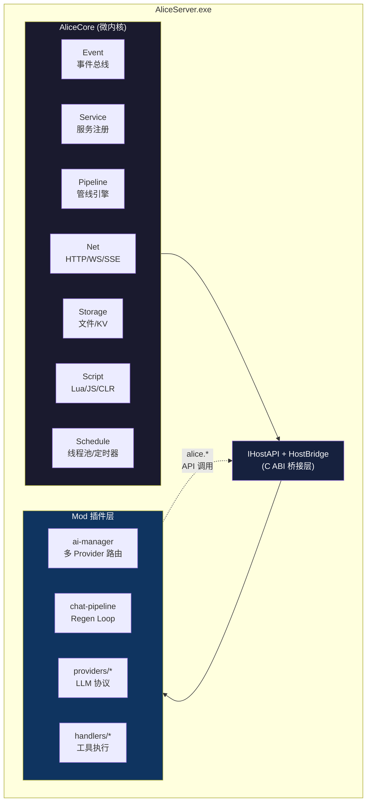
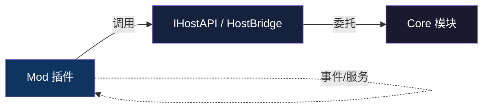
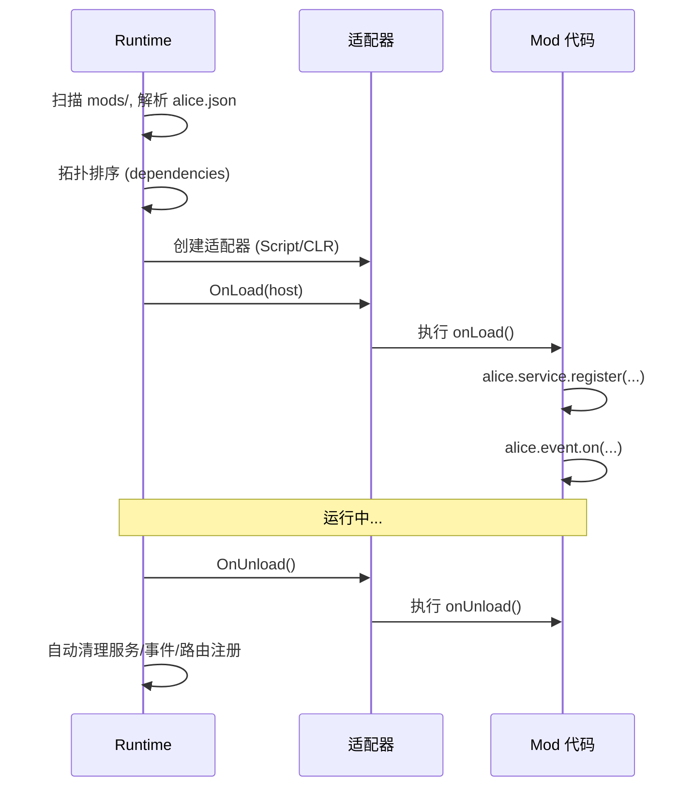
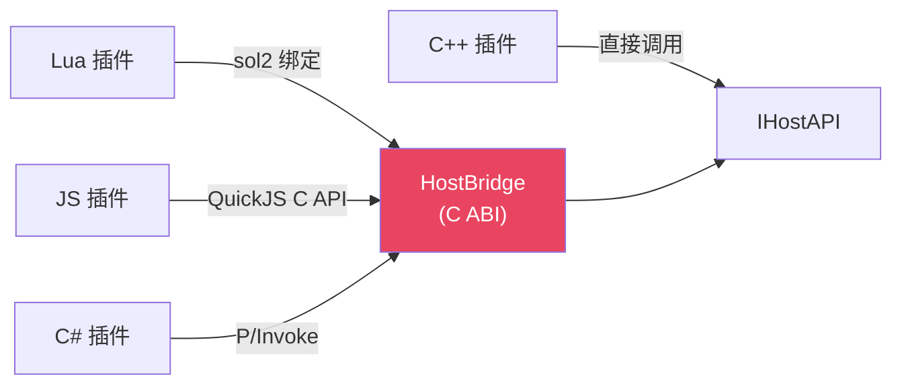
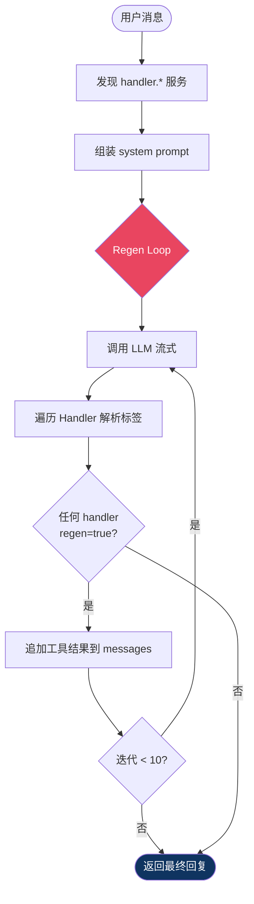
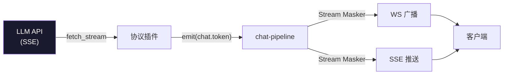

# 架构

## 总览

Alice 是微内核架构。Core 极小，只提供运行时能力，不包含业务逻辑。

## 依赖方向

单向依赖。Core 不引用任何 Mod。Mod 之间通过事件和服务通信，不直接引用。

## Core 模块职责

| 模块 | 文件 | 职责 |
|------|------|------|
| Runtime | Runtime.h/.cpp | 启动/关闭/生命周期，插件拓扑排序加载 |
| Event | EventBus.h/.cpp | 事件总线，同步/异步，TTL + 深度治理 |
| Service | ServiceRegistry.h/.cpp | 通用能力注册/调用/等待 |
| Pipeline | Pipeline.h/.cpp | 管线引擎，Continue/Break/Retry/Error |
| Net | HttpServer, HttpClient, RouteRegistry, WsRouter, SseParser | HTTP/WS/SSE |
| Storage | FileStorage, KvStore, Config | 文件读写 + KV + 配置 |
| Script | LuaEngine, QuickJSEngine, ClrHost, HostBridge | 三引擎 + C ABI 桥接 |
| Schedule | ThreadPool, Timer | 线程池 + 定时器 |
| Plugin | PluginRegistry, ScriptPluginAdapter, ClrPluginAdapter | 插件管理 |
| Host | IHostAPI, HostAPIImpl | 子接口聚合 + 实现 |
| Platform | Platform.h, WinPlatform.cpp | 平台抽象 (FsWatcher, 路径) |
| Trace | Trace.h/.cpp | 链路追踪 |

## 插件生命周期

## HostBridge — 跨语言桥接

IHostAPI 用了 C++ 类型 (std::string, json, std::function)，不能直接跨 DLL/语言边界。
HostBridge 是它的 "C 投影"：一个纯 C 函数指针表，参数只用 `const char*`、`int`、`void*`。

## Regen Loop (Agent 循环)

## 流式输出

Stream Masker 是逐字符状态机：普通文本立即转发，检测到标签开头则缓冲并显示占位符。
